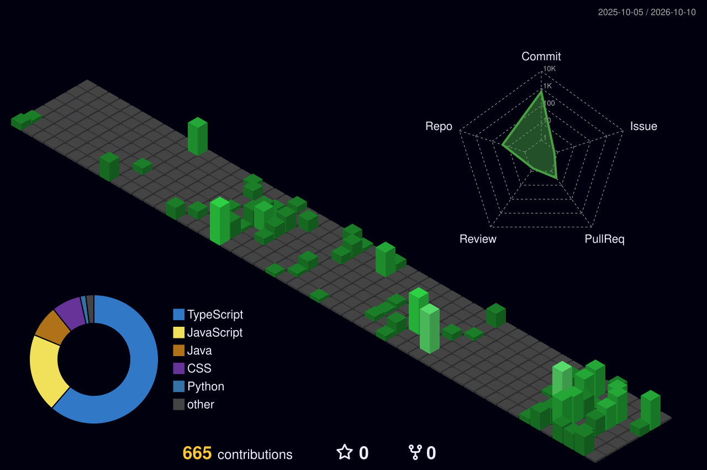
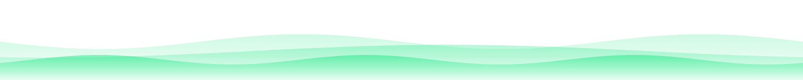

  

I build web apps end to end, and I'm getting deeper into AI and backend engineering. 
Right now: **RepoGuide**, an AI copilot that helps people make their first open source contribution.

 

 

 

